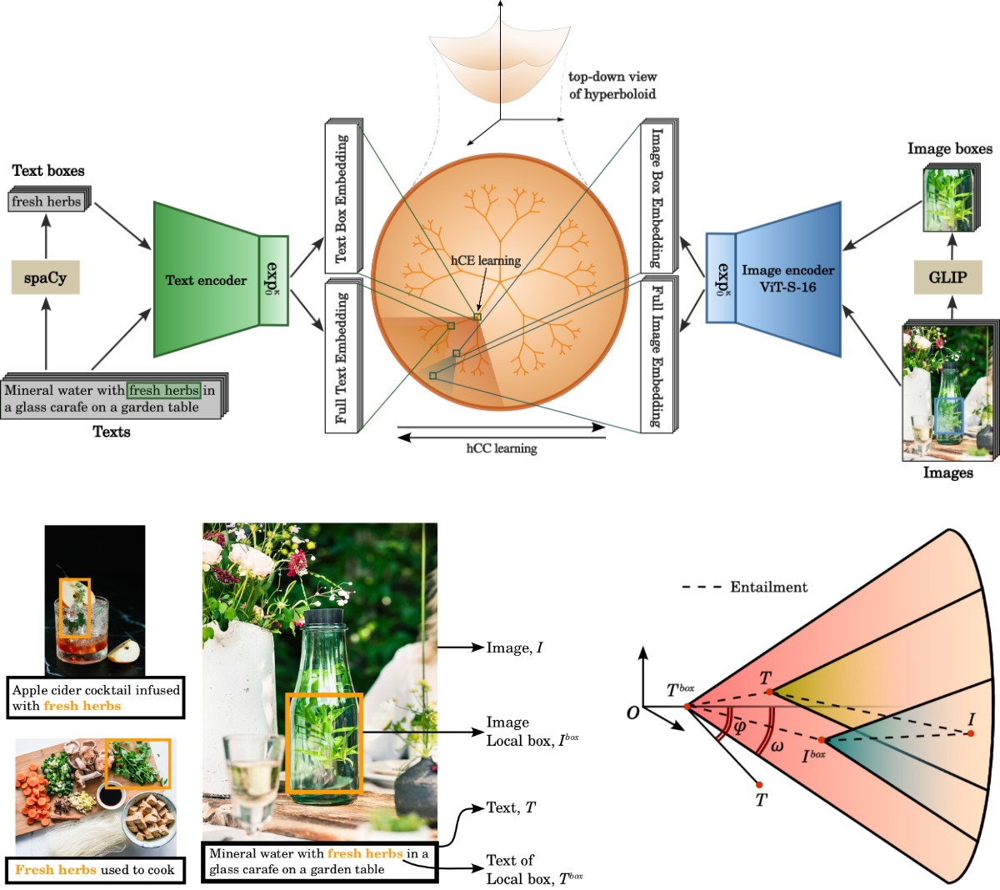
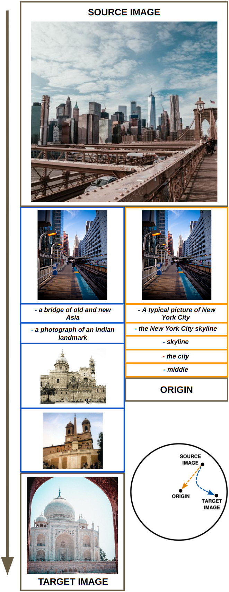

# Compositional Entailment Learning for Hyperbolic Vision-Language Models

[[Arxiv](https://arxiv.org/abs/2410.06912)]

Avik Pal, Max van Spengler, Guido D’Amely, Alessandro Flaborea, Fabio Galasso, Pascal Mettes

**Codebase adapted from [MERU](https://github.com/facebookresearch/meru).**

<p align="center"></p>

_Figure 1. (Top) Embeddings of image-text pairs and corresponding boxes from encoders are lifted onto the hyperbolic space. (Bottom-left) Both the full and local box information within images and texts are utilized for semantic and hierarchical representation learning. (Bottom-right) Zooming in to the enforced compositional structure of hyperbolic space. The external angle ϕ of a specific concept (T) is pushed to be within the aperture threshold ω of the general concept (T<sup>box</sup>)._

## Installing environment

Set-up codebase with [Conda](https://conda.io/docs/user-guide/install/download.html) using following commands:

```
git clone git@github.com:PalAvik/hycoclip.git
cd hycoclip
conda create -n hycoclip python=3.9 --yes
conda activate hycoclip
```

Install torch and torchvision following instructions at [pytorch.org](https://pytorch.org). Then install this codebase with dependencies using following commands (Note: Using `develop` makes the package editable in-place):

```
python -m pip install --pre timm
python -m pip install -r requirements.txt
python setup.py develop
```

## Pre-trained models

Download models from [`model-zoo`](./model-zoo.md) and place it in `./checkpoints` directory.

## Evaluate trained models

1. **Zero-shot image classification**:

The evaluation script auto-downloads and caches 18 (out of 20) datasets in `./datasets/eval`, for ImageNet and Stanford Dogs follow as next. Download and symlink the ImageNet dataset ([Torchvision ImageFolder](https://pytorch.org/vision/main/generated/torchvision.datasets.ImageFolder.html)
style) at `./datasets/eval/imagenet`. The Stanford Dogs dataset also needs to be set-up manually using instructions provided in [Pytorch issue 7545](https://github.com/pytorch/vision/issues/7545#issuecomment-1631441616) at `./datasets/eval/cars/stanford_cars`. To evaluate HyCoCLIP-ViT-S/16 on the datasets, run the following command.

```
python scripts/evaluate.py --config configs/eval_zero_shot_classification.py \
    --checkpoint-path checkpoints/hycoclip_vit_s.pth \
    --train-config configs/train_hycoclip_vit_s.py
```

2. **Zero-shot image and text retrieval**:

Following datasets are configured in code - COCO captions and Flickr30k captions. Please refer to the documentation in [`hycoclip/data/evaluation.py`](./hycoclip/data/evaluation.py) on how to arrange their files in `./datasets/coco` and `./datasets/flickr30k`. To evaluate HyCoCLIP-ViT-S/16 on these 2 datasets, run the following command.

```
python scripts/evaluate.py --config configs/eval_zero_shot_retrieval.py \
    --checkpoint-path checkpoints/hycoclip_vit_s.pth \
    --train-config configs/train_hycoclip_vit_s.py
```

3. **Hierarchical classification**:

We use the WordNet hierarchy of the ImageNet class labels in `./assets/imagenet_synset` for the hierarchical classification task. ImageNet evaluation dataset needs to be configured as mentioned in _point 1_. To evaluate HyCoCLIP-ViT-S/16 on this task, run the following command:

```
python scripts/evaluate.py --config configs/eval_hierarchical_metrics.py \
    --checkpoint-path checkpoints/hycoclip_vit_s.pth \
    --train-config configs/train_hycoclip_vit_s.py
```

## Interpolating between points



We use [grounded Flickr dataset](https://github.com/gligen/GLIGEN/blob/master/DATA/README.MD) (grounded in the same manner as GRIT) to populate the hyperbolic space. First, we download the dataset from [huggingface/gligen/flickr_tsv](https://huggingface.co/datasets/gligen/flickr_tsv/tree/main) using the following command:

```
huggingface-cli download gligen/flickr_tsv --repo-type dataset --local-dir ./datasets/flickr_grounded/tsvfiles/
```

Features for image-text-boxes are automatically generated and saved to a path using [`scripts/interpolating_points.py`](./scripts/interpolating_points.py). We use pictures from [pexels.com](https://pexels.com) to interpolate points in between their features and extract nearest images/texts from grounded flickr. This interpolation is between an image to the origin by default. Interpolation between images could be enabled with the flag `--image-to-image-traversal`. The command is as follows:

```
python scripts/interpolating_points.py --image-path assets/new_york.jpg --target-image-path assets/taj_mahal.jpg --image-to-image-traversal \
    --steps 100 --checkpoint-path checkpoints/hycoclip_vit_s.pth --train-config configs/train_hycoclip_vit_s.py \
    --data-path ./datasets/flickr_grounded/tsvfiles --feats-path ./datasets/flickr_grounded/flickr_grounded_feats.pt
```

Example output from the command:

```
Performing image to root traversals with source: assets/new_york.jpg...

Texts retrieved from [IMAGE] -> [ROOT] traversal:
  - 4502489690.jpg_[4.0, 3.0, 369.0, 497.0]
  - A typical picture of New York City
  - the New York City skyline
  - skyline
  - the city
  - middle
  - [ROOT]

Performing image to image traversals with source: assets/new_york.jpg and target: assets/taj_mahal.jpg...
Texts retrieved from [SOURCE IMAGE] -> [TARGET IMAGE] traversal:
  - 4502489690.jpg_[4.0, 3.0, 369.0, 497.0]
  - a bridge of old and new Asia
  - a photograph of an indian landmark
  - 2234681386.jpg_[2.0, 49.0, 373.0, 295.0]
  - 11245644.jpg_[1.0, 80.0, 347.0, 305.0]
```

Image boxes are represented in the format [image].jpg\_[xmin, ymin, xmax, ymax] and thus could be cropped-out separately if needed. Users are encouraged to try with their own images.

## Model Training

### Set-up training data - GRIT

Firstly, the raw GRIT dataset (in webdataset format) has to be downloaded following instructions of [huggingface/zzliang/GRIT](https://huggingface.co/datasets/zzliang/GRIT). For faster training we pre-process the dataset by extracting out box information of each sample by running the following command:

```
python utils/prepare_GRIT_webdataset.py --raw_webdataset_path datasets/train/GRIT/raw \
    --processed_webdataset_path datasets/train/GRIT/processed \
    --max_num_processes 12
```

### Training command

To train a HyCoCLIP-ViT-S/16 model, run the following command:

```
python scripts/train.py --config configs/train_hycoclip_vit_s.py --num-gpus 4 --output-dir ./train_results/hycoclip_vit_s --checkpoint-period 100000 --resume
```

Training hyperparameters could be easily modified in the [config files](./configs/) or directly within the command (For e.g., add `train.total_batch_size=768` to the command to change batch size).

## Visualizing spatial norms in hyperbolic space

The training data has to be preparaed first, following instructions in the previous section. To visualize the histogram of spatial norms, run the following command:

```
python scripts/spatial_norm_dist.py --checkpoint-path checkpoints/hycoclip_vit_s.pth \
    --train-config configs/train_hycoclip_vit_s.py \
    --dist-save-path visualizations/radius_distribution_hycoclip_vit_s.png
```

## Citing this work

If this work was helpful in your research, please use the following BibTex entry.

```bibtex
@article{PalSDFGM2024,
      title={Compositional Entailment Learning for Hyperbolic Vision-Language Models},
      author={Avik Pal and Max van Spengler and Guido Maria D'Amely di Melendugno and Alessandro Flaborea and Fabio Galasso and Pascal Mettes},
      year={2024},
      eprint={2410.06912},
      archivePrefix={arXiv},
      primaryClass={cs.CV},
      url={https://arxiv.org/abs/2410.06912},
}
```

This work is licensed under CC-BY-NC.
